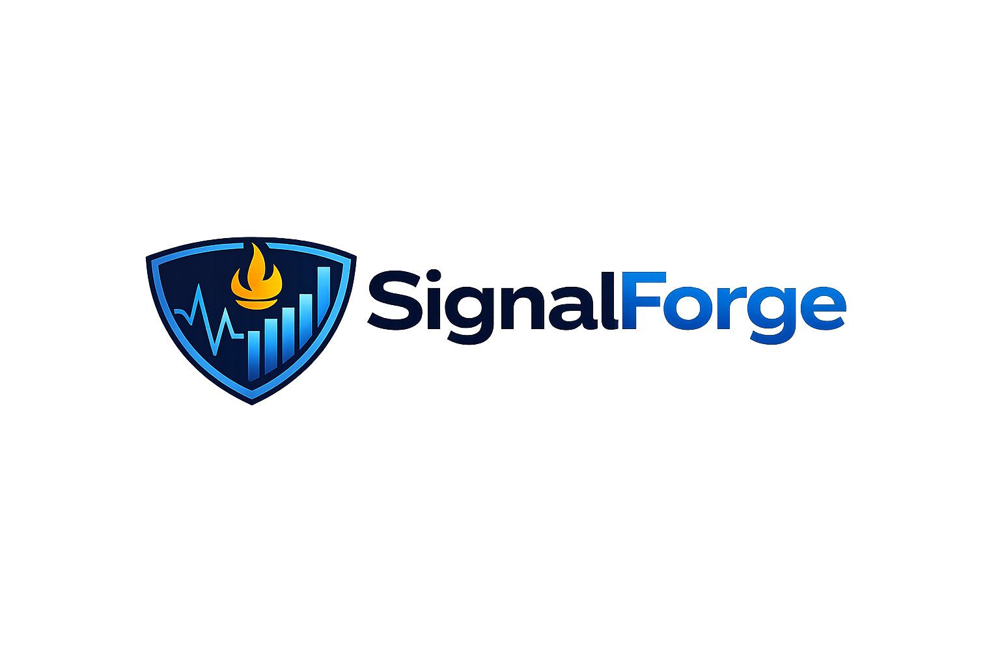

This project is a hands-on homelab built to gain practical exposure to production monitoring, logging, troubleshooting, and backend service dependencies in a Linux environment.

The lab is centered around a small application stack running inside an Ubuntu Server virtual machine and is designed to simulate the kinds of workflows involved in operations, support, and incident response. It brings together tools and concepts including Docker, PostgreSQL, Prometheus, Grafana, Splunk, and Kubernetes to help build familiarity with metrics, logs, dashboards, SQL-backed services, and deployment troubleshooting.

The goal is not just to install the tools, but to use them in a way that reflects real operational work: building a service, monitoring it, introducing failures, investigating symptoms, and documenting recovery steps and lessons learned.

## Objectives

- Build a small SQL-backed application stack
- Gain exposure to observability tooling such as Prometheus, Grafana, and Splunk
- Practice working with containers and lightweight Kubernetes
- Simulate service and database failures
- Improve troubleshooting, incident triage, and operational thinking
- Document setup steps, incidents, and runbooks for future reference

## Tech Stack

- Ubuntu Server 24.04 LTS
- Docker / Docker Compose
- Python
- PostgreSQL
- Prometheus
- Grafana
- Splunk
- Kubernetes (light exposure for basic deployment and troubleshooting concepts)

## Architecture

SignalForge is being built inside an Ubuntu Server virtual machine. The lab will host a small application stack backed by PostgreSQL, with Prometheus collecting metrics, Grafana visualizing service health, Splunk ingesting logs, and Kubernetes used for lightweight deployment exposure and troubleshooting practice.

## Project Structure

- `app/` - application source code and build files
- `db/` - database initialization and SQL practice
- `docker/` - Docker Compose configuration
- `prometheus/` - metrics scraping and alert rules
- `grafana/` - dashboard notes and exports
- `splunk/` - log ingestion notes and searches
- `k8s/` - Kubernetes manifests
- `scripts/` - helper and troubleshooting scripts
- `docs/` - setup notes, architecture, incidents, runbooks, and project log

## Future Improvements

- Add application metrics and endpoint health checks
- Expand incident simulations across app, database, and Kubernetes layers
- Improve dashboard coverage for host, app, and database health
- Refine log searches and incident runbooks
